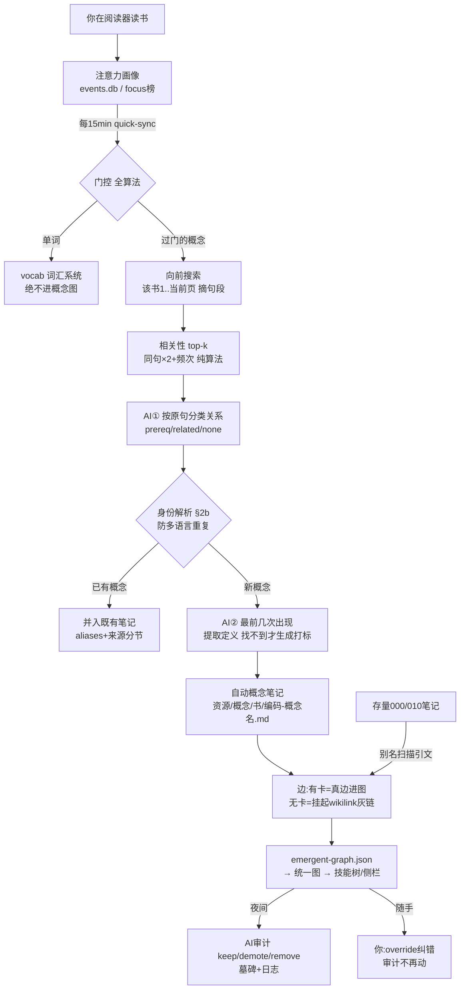

# 概念网系统完整报告(2026-07-19)

> 本报告描述已建成并验证的「emergent 概念网」全系统:从你读书的行为里自动长出概念笔记和知识网络,
> 算法做绝大部分工作,AI 只在少数有界节点上判断,后台审计代替人工逐条确认。
> 算法规格:`references/emergent-edge-algorithm.md`(定稿 v3);实现分支 `learning-loop-review-fixes`(未合并)。

---

## 一、设计哲学(三次转向后的最终形态)

这套系统经历了三次方向收敛,每次都由实测数据推动:

1. **抛弃预建骨架**。原来的思路是先人工/AI 建好整棵技能树再挂数据。实测发现:有骨架的书(LADR)没人在读、
   在读的书(料理師/応用情報)没骨架——骨架和活动完全错位。结论:**不预建,让节点和边从学习活动里涌现**。
2. **算法为主,AI 有界**。第一版让 AI 猜"哪两个概念相关、什么关系",用量大且不可靠(把"F^n 是向量空间的例子"
   误判成前置)。反转分工:**候选、方向、证据句全部由算法从原文机械拼装,AI 只对拼好的成品做小判断**。
3. **笔记为骨骼 + 审计代替确认**。概念=一篇 Obsidian 笔记,边=笔记里的 wikilink;人工逐条确认边偏离自动化
   初衷,改为**边生成即生效 + 后台 AI 定期审计**,你想改随手改(改过的审计不再动)。
   例外:**掌握度**变更仍必须你确认(铁律不变——知识结构 AI 可自查,你的状态只有你能定)。

---

## 二、系统全景



---

## 三、七个环节详解

### 1. 门控(全算法,决定"这个词配不配成为概念")

注意力榜上的词要连过五道门才会触发建卡:

| 门 | 规则 | 冷启动实测 |
|---|---|---|
| vocab 路由 | 归一键**和**原 surface 双查 vocab 库(修了繁简 bug:norm_key 把 議事→议事 而库存原形);库不可达时 **fail-closed** 全拒 | 議事/公衆/行政…全部拦下 |
| 碎片门 | 是更长 vocab 词的子串 → 丢(公衆⊂公衆衛生) | 保健所/テスト 拦下 |
| 科目门 | 注册表里该书 `enabled:false` 就不开火;**新书默认关** | 料理師/応用情報 默认关 |
| 热度阈值 | 焦点榜 top-20 且 (近7天≥3次 或 burst≥3) | — |
| 渠道阈值 | ≥2 个渠道且含 ≥1 深渠道(高亮/提问/检查/停留;光查词不算) | — |

实测:16 个日语焦点词**全部被正确拦下,零垃圾**——冷启动"不生成"是设计的正确行为,不是缺陷。

### 2. 存量引文扫描(你已有的笔记 → 边,零 AI 拼装)

对已有的 000-/010- 笔记:
- **别名表**:节点名 + 你文本里的真实写法 + 后缀剥离(「导数的定义」也认「导数」)+ 手工变体(Fn→F^n);
- **可扫描正文分两档**:`<!-- 原文 -->` 引文块=tier1 高置信;你手写的散文=tier2 普通置信;
  **AI 生成的块(图片描述/相关笔记/AI 解释)剥掉绝不扫**——防"AI 写的变成边再喂回 AI"的自强化环;
- A 的别名出现在 C 的正文里 ⟹ 候选有向边 A→C,方向天然(被写进定义的是前置侧),证据句逐字抠出;
- **AI 只做一句话确认**:每条候选给它证据句,回 prereq(前置)/demote(降相关)/drop(丢弃),10 条一批几分钱,按句缓存。

实测(11 篇笔记):15 候选 → **7 前置 + 4 降级 + 4 丢弃**。降级的正是该降的("F^S 获得向量空间身份"=成员关系;
"线性无关看作直和的特殊情况"=类比);丢弃的是证据撑不住的。旧版 AI 猜名字造出的错边(fn→向量空间)自然消失。

### 3. 阅读时生长(主流程,任何书通用,不依赖书有规整定义句)

以实测的 `食中毒`@料理師 为例走一遍:

1. 注意力发现「食中毒」热度达标,过门(测试时 force);
2. **向前搜索**:全文索引里搜该书第 1 页~当前页,摘出它出现的 16 处句子+段落
   ("向前"自带方向——教科书先讲前置,前文里的相关词天然偏前置侧);
3. **相关性排序**(纯算法):句段里其它词按 同句×2+频次 排出 top-4:感染症/本当/食品衛生法/栄養統計;
4. **AI①** 按原句分类:滤掉噪声(本当/栄養統計),留 感染症=相关、食品衛生法=相关;
5. **身份解析**(见环节4):食中毒=新概念;
6. 机械查卡:感染症/食品衛生法 都没有卡 → **挂起边**(不递归新建);
7. **AI②** 拿它最前 2-3 次出现的前后文找定义:那几页讲统计没有真定义句 → **诚实生成并打标**
   「AI 生成(仅参考,非原文)」;
8. 生成笔记(dry-run 预览,见环节5),分配编码 `200`。

### 4. 多语言身份(防 vector space 和 向量空间 裂成两篇)

三道防线:
- **建卡前**:norm_key 精确 → concepts.json 身份表 → 笔记 aliases 反查 → 外语新词做一次有界 AI 判
  ("和清单里哪个是同一概念?");
- **命中即合并不新建**:外语名写进既有笔记 frontmatter `aliases:`,新书定义句追加成来源分节
  (**一概念一笔记**,编号第三位记"出生书");
- **判不准就缓建**(待定队列,夜间归并定夺),真漏出重复由夜间归并自动合并+日志。

### 5. 笔记形态(Obsidian 为骨骼)

```markdown
---
type: concept-auto        ← 机器所有权标记(pending_notes 见它就跳过,不会被自动做成 Anki 卡)
book: 资源/uploads/料理师part2.pdf
code: "200"               ← 你的三位编码:科目/细分/源头
status: auto              ← auto → audited → user-edited(你编辑过=升格为你的笔记)
aliases: []               ← 多语言别名落这里
---
# 食中毒

## 定义
> (逐字原文定义句 + 页锚 ![[书.pdf#page=N]];找不到时:**AI 生成(仅参考,非原文)**:…)

## 概念链接(自动)      ← 整区机器重写;区外你写的任何东西永久保留
- 相关:[[200-感染症|感染症]] — 证据 p22:「感染症統計は感染症法に基づくもの…」

## AI 解释(自动)
```

- **编码注册表** `note-codes.json`:每本书自动分配三位码(新书默认 enabled:false),你可改科目名/开火;
- **挂起边 = Obsidian 未解析链接**:`[[200-感染症|感染症]]` 灰显,那个词日后自己攒够注意力成卡时
  链接自动变实、挂起边自动转正(pending-edges.json 激活),零额外机制;
- Obsidian 自带 Graph View 免费成为概念网可视化;
- 文件名带编码但 wikilink 用别名形式,正文显示干净。

### 6. 审计(代替人工逐条确认)

- 边生成即生效(`status:auto`,技能树直接可用);
- 夜间审计抽查(≤20 条/轮):未审过的 auto 边、散文来源(tier2)边、AI 缺答边——重读证据句±上下文,
  批量判 keep(→audited)/ demote(→降 related)/ remove(→**墓碑**,不物理删可恢复),写 `edge-audit-log.jsonl`;
- **你随手纠错**:技能树 unified 页的确认/否决现在是 override——你签过字的边审计永远不再碰;
- 实测 11 边:keep 8 / demote 3 / remove 0。

### 7. 接线(自动化节奏)

| 任务 | 频率 | 内容 | AI |
|---|---|---|---|
| quick-sync | 每 15 分钟 | 候选检测:评估注意力榜哪些词过门,落 `autonote-candidates.json` 供观察 | 0 |
| daily(夜间) | 每天 | ①概念笔记生长(--run,科目门自守)②存量扫描拼边 ③边审计 | 有界几次 |

---

## 四、AI 出现的全部位置(有界性一览)

| 位置 | 输入 | 输出 | 频率 |
|---|---|---|---|
| ① 关系分类 | 主体词 + top-4 相关词 + 各原句 | 每词 prereq/related/none | 每个新概念 1 次 |
| ② 定义提取 | 最前 2-3 次出现的前后文 | 逐字引用(子串校验)或生成打标 | 每个新概念 1 次 |
| ③ 存量边确认 | 算法抠好的证据句 | prereq/demote/drop | 每句 1 次,永久缓存 |
| ④ 身份判定 | 外语新词 + 既有概念清单 | 匹配哪个或 null | 仅外语新词 |
| ⑤ 夜间审计 | 证据句 ± 上下文 | keep/demote/remove | ≤20 条/晚一批 |

共同约束:只能在算法给定的选项里选、引用必须过子串校验、输出严格 JSON、失败不硬编(缓建/留待下轮)。
**AI 无法发明概念、无法发明边、无法伪造证据**——这些全是算法从原文机械产出的。

## 五、可靠性设计汇总

- 证据句 100% 逐字来自原文(子串校验),每条边可追溯到"哪篇笔记/哪页书的哪句话";
- AI 生成内容三重隔离:定义打标"仅参考"、AI 块剥离不扫描、自动笔记不进登记→Anki 管线;
- 摘除不物理删(墓碑可恢复)、防环只剔证据最弱一条、传递归约只 shadow 不删;
- vocab 门 fail-closed(评估不了就全拒,绝不 fail-open);
- 用户主权:override 永久生效、区外笔记内容永久保留、掌握度必须确认。

## 六、当前状态与两个开关

**已验证可用,但处于"待命"**:
1. **daily timer 关着**(学习闭环审查时定的)——生长/审计三步已挂好,重开即自动运转;
2. **科目门全书 enabled:false**——要让哪本书开始自动长,在 `state/attention/note-codes.json` 把它设 true。
   建议:开始读数理类教材时再开;日语考试书保持关(那些词归 vocab,是正确行为)。

分支 `learning-loop-review-fixes`(20+ commits)未 push 未 merge。

## 七、已知边界(诚实清单)

- **E 共现辅助未做**(排序/旁证/补漏提示)——冷启动共现仅 9 对,数据厚了再接;
- 审计的"被诊断数据反证的边"通道有位置没数据(诊断量还少);
- 笔记的「AI 解释(自动)」区留了占位未生成(可关的增值项);
- 身份解析的外语 AI 判只在英文书场景才会真正用到,冷启动验证少;
- 日语相关词的 STOP 表偏中文(噪声词"本当"漏到了 AI①,被 AI 滤掉了——净结果对,但算法层可再省一步);
- LADR 的 KG pages 原文(mangled 字体)未当扫描源,现只扫笔记——够用,书页扫描是后续增强。

## 八、文件与提交索引

| 文件 | 职责 |
|---|---|
| `scripts/kg/promote_concepts.py` | 节点收集(vocab 门)+ 存量扫描拼边 + AI 句确认 |
| `scripts/kg/propose_concept_notes.py` | 阅读时生长主流程 + 概念笔记生成 + 挂起边 + detect-only |
| `scripts/kg/audit_edges.py` | 夜间边审计(墓碑+日志) |
| `scripts/kg/build_unified_graph.py` | 统一图合并(authored+emergent+override 应用) |
| `scripts/pending_notes.py` | 排除 concept-auto(防 Anki 污染环) |
| `state/attention/emergent-graph.json` | 概念网真相(节点+边) |
| `state/attention/note-codes.json` | 编码注册表(科目门开关在此) |
| `state/attention/pending-edges.json` / `edge-confirm-cache.json` / `edge-audit-log.jsonl` / `autonote-candidates.json` | 挂起边 / AI 确认缓存 / 审计日志 / 候选观察 |
| 主要 commits | A:71c081c B:9b12c94 C:41ad28f D:baea21c 定稿:f65675f/4489f68/6193ed5 |
